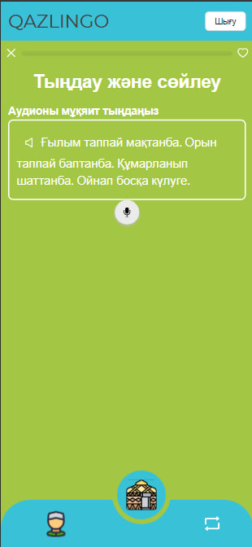

# Перед запуском нужно

Создать файл `.env.dev`, с данными заполненными полями:

```plaintext
VITE_API_URL = ""
VITE_VOICE_API_URL = ""
```

### Для запуска прокета нужно:

- С клонировать бэкенд по [ссылке](https://github.com/AbylaiNur/hackathon-template)
- Установить все зависимости командой `npm install`
- Запустить проект: `npm run dev`

 

## PS

Предпочтительно использовать пакетный менеджер `pnpm`, для много-поточного распределения
